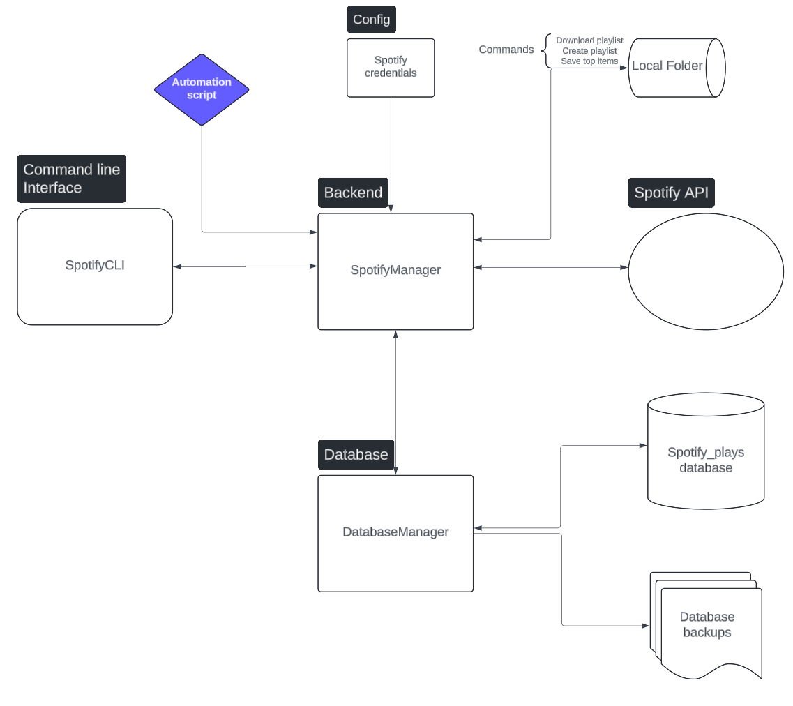
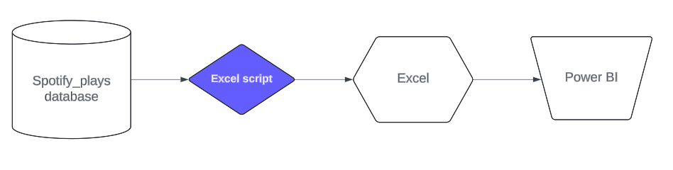

# Spotify Project

---

## Table of Contents
1. [About the Project](#about-the-Project)
2. [Command-Line Application Features](#command-line-application-features)
3. [Technologies Used](#technologies-used)
4. [Architecture](#architecture)
5. [Results](#results)
6. [Contact](#contact)

---

## About the Project

This project focuses on tracking, analyzing, and visualizing my Spotify listening habits to showcase my skills in Python, Excel, and Power BI. 
It began as a way to gain deeper insights into my music preferences since Spotify only provides limited data through its annual Wrapped feature. 
To address this limitation, I developed a system for automatically tracking the songs I listen to, enabling me to collect and analyze my own data.

---

## Command-Line Application Features

The core functionality of this command-line application is to fetch recently played songs and store them in a database.

Additionally, the user can leverage the `SpotifyManager` class to run a script that fetches and stores tracks without user interaction. This feature makes the process fully automated.

The command-line application also includes several additional tools designed for flexibility and convenience:

- **View all owned playlists**: Explore all playlists associated with your account.  
- **Download a playlist to a CSV file**: Export playlist data for further analysis or backup.  
- **Create a playlist from a CSV file**: Easily generate new playlists from CSV data.  
- **Delete a playlist**: Remove playlists directly, even when the Spotify app encounters issues.  
- **Save top items to a CSV file**: Export your top tracks or artists for deeper insights.  
- **View last played tracks (up to 50)**: Quickly review your most recently played songs.

These features serve multiple use cases, offering practical tools while laying the groundwork for future enhancements. Whether for troubleshooting or expanding functionality, they make managing Spotify data more efficient and customizable.

---

## Technologies Used

- **Python:** The core application, including command-line functionality and backend processes, is developed in Python, utilizing the Spotify API for data extraction.
- **SQLite:** A lightweight SQLite database is used for data storage, eliminating the need for external hosting.
- **Excel:** Employed for comprehensive data analysis and reporting.
- **Power BI:** Used for creating dynamic and interactive visualizations.

The application code is available on [GitHub](https://github.com/iljateerikorpi/Spotify-Public).

---

## Architecture

### Overview

The system architecture is built around interconnected components designed to facilitate seamless tracking, storage, and additional functionality. 
At its core lies the `SpotifyManager` class, which serves as the central hub for managing all interactions with the Spotify API and the system's features.

### Workflow diagram

### Key components

- **Command-Line Interface:** Provides a user-friendly interface to access and control various features of the application.
- **Backend:** Powered by the `SpotifyManager` class, which orchestrates interactions between the API, database, and other components to deliver core functionality.
- **Spotify API:** Spotify API: Works in tandem with the `SpotifyManager` class to fetch data, manage playlists, and perform other Spotify-related operations.
- **Database:** Managed by the `DatabaseManager`, which acts as the bridge between the backend and the database. It also ensures data integrity by creating regular backups.

### Automation

Highlighted in purple is the optional automation script, designed to streamline processes by bypassing user interaction. 
A sample script is available on [GitHub](https://github.com/iljateerikorpi/Spotify-Public/tree/main/scripts/automation%20scripts) for reference.

### Data analysis

To generate insights from the collected data, both Excel and Power BI were utilized.
Excel provides quick, actionable insights through pivot tables and built-in functions, while also serving as a data source for Power BI.
For more detailed and interactive visualizations, Power BI is employed, enabling deeper exploration of listening trends.

Since SQLite databases are not natively supported by Excel or Power BI, a Python script is used to automate the data export process. An example script is available on [GitHub](https://github.com/iljateerikorpi/Spotify-Public/tree/main/scripts/automation%20scripts) for reference.
Once the Python script initializes the Excel table, it can be reused for future updates. After the data is successfully exported to Excel, it becomes readily accessible for use in Power BI, streamlining the analysis workflow.

---

## Results

To maintain privacy, the complete dataset will not be shared. Instead, curated insights and analyses from November 2024 will be presented, highlighting select artists to showcase the project's capabilities and potential.
The analysis I aim to conduct will require a significantly larger dataset collected over an extended tracking period.

### Excel Analysis: Quick Insights

While Excel primarily served as a source for Power BI, it also proved invaluable for quick insights into my listening data.

A pivot table is a dynamic tool for extracting insights efficiently. In this example, using slicers, I analyzed how many minutes I listened to Drake in November and identified the specific songs that contributed to this total.

By leveraging Excel functions, I further explored which Drake albums I listened to the most during this period.

Finally, I created a simple table and chart from the collected data to visualize when the majority of my most-played Drake songs were released.

### Power BI Dashboard

Power BI provides deeper insights into my listening habits through an interactive and dynamic dashboard. These screenshots demonstrate its functionality:

When specific artists are selected, their corresponding data is displayed, offering a focused view of listening trends.

*For licensing reasons, the dashboard is not embedded directly on this site. Instead, screenshots are provided for demonstration purposes.*

---

## Contact

For any inquiries or to learn more about this project, feel free to get in touch:

- **GitHub**: [iljateerikorpi](https://github.com/iljateerikorpi)
- **LinkedIn**: [Ilja Teerikorpi](https://www.linkedin.com/in/ilja-teerikorpi-a67377318/)
- **Email**: teerikorpiilja&#43;project&#64;gmail&#46;com

---

Thank you for visiting this page! Check out the [GitHub repository](https://github.com/iljateerikorpi/Spotify-Public) for more details.

*The page was last updated on 5.12.2024.*